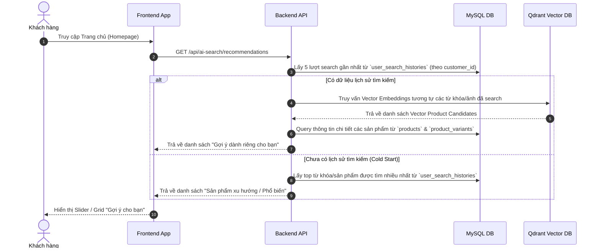

# AI Recommendation System (Gợi Ý Sản Phẩm Thông Minh)

Tài liệu thiết kế và định hướng tính năng **Hệ thống Gợi ý Sản phẩm Cá nhân hóa** dựa trên Lịch sử Tìm kiếm của Người dùng.

---

## 1. Tổng Quan Feature

Hệ thống AI Recommendation tự động cá nhân hóa bảng tin trang chủ (**Homepage Feed**) cho từng khách hàng (`customer_id`) bằng cách khai thác dữ liệu từ bảng `USER_SEARCH_HISTORIES`.

* **Mục tiêu:** Tăng tỷ lệ chuyển đổi (Conversion Rate), giảm thời gian tìm kiếm của khách hàng, tạo trải nghiệm mua sắm thông minh.
* **Đối tượng áp dụng:**
  * **Khách hàng đã đăng nhập (`customer_id` có giá trị):** Gợi ý cá nhân hóa sâu theo lịch sử tìm kiếm từ văn bản (Text Query) và hình ảnh (Visual Search).
  * **Khách vãng lai (`customer_id` là `NULL`):** Gợi ý theo các sản phẩm/từ khóa đang Hot (Trending Keywords/Products).

---

## 2. Luồng Xử Lý (Workflow)



---

## 3. Thiết Kế API Draft

### `GET /api/ai-search/recommendations`

* **Auth:** Optional (Bearer Token nếu đã đăng nhập)
* **Query Parameters:**
  * `limit` (number, default: 10): Số sản phẩm gợi ý tối đa.

#### Response `200 OK`

```json
{
  "status": true,
  "message": "Lấy danh sách gợi ý sản phẩm thành công",
  "data": {
    "recommendation_type": "PERSONALIZED", // "PERSONALIZED" hoặc "TRENDING"
    "products": [
      {
        "product_id": 12,
        "product_name": "Áo Blazer Nam Hàn Quốc Dáng Rộng",
        "primary_image": "https://cdn.fashionai.com/products/blazer-01.jpg",
        "min_price": 450000,
        "reason": "Dựa trên tìm kiếm gần đây: 'Áo khoác blazer nam'"
      }
    ]
  }
}
```

---

## 4. Các Bảng Database Liên Quan

1. **`user_search_histories`**: Cung cấp dữ liệu `query_text`, `search_image_url`, `search_type` làm đầu vào tính toán gợi ý.
2. **`customers`**: Xác định danh tính người dùng.
3. **`products` & `product_images`**: Cung cấp thông tin hiển thị sản phẩm gợi ý.
4. **`product_embeddings`**: Tra cứu điểm vector tương ứng trong Qdrant.
